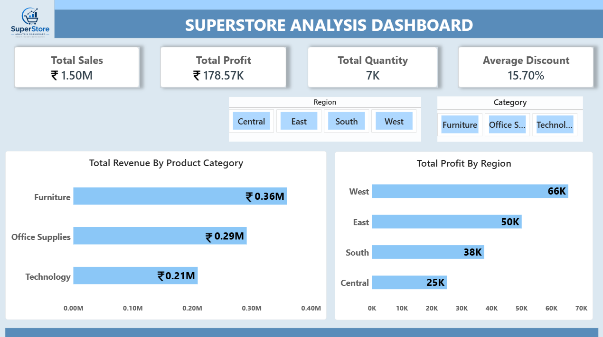

# 📊 Superstore Analysis Dashboard

### 📌 Project Overview

The Superstore Analysis Dashboard is an interactive Power BI dashboard developed to analyze and visualize key business metrics from a retail superstore dataset. The dashboard provides a comprehensive overview of sales performance, profitability, product category contributions, and regional business insights.

Designed with a clean and professional layout, this dashboard enables stakeholders, managers, and analysts to monitor business performance and make data-driven decisions efficiently.

---

### 🖼️ Dashboard Preview

---

### 🎯 Project Objectives

- Analyze overall sales and profit performance.
- Track key business KPIs.
- Identify top-performing product categories.
- Compare profitability across regions.
- Enable interactive filtering for detailed analysis.
- Support business decision-making through visual insights.

---

### 📈 Key Performance Indicators (KPIs)

KPI| Value
Total Sales| 1.50M
Total Profit| 178.57K
Total Quantity| 6.526K
Average Discount| 0.16

---

### 📊 Dashboard Features

1. KPI Cards

Provides a quick summary of:

- Total Sales
- Total Profit
- Total Quantity Sold
- Average Discount

2. Revenue Analysis by Product Category

Analyzes revenue generated from:

- Furniture
- Office Supplies
- Technology

3. Profit Analysis by Region

Compares profitability across:

- West
- East
- South
- Central

4. Interactive Slicers

Users can dynamically filter dashboard data by:

Region

- Central
- East
- South
- West

Category

- Furniture
- Office Supplies
- Technology

---

### 🛠️ Tools & Technologies Used

- Power BI Desktop
- Data Modeling
- DAX Measures
- Data Visualization
- Interactive Slicers
- Business Intelligence Techniques

---

### 📂 Dataset Information

The dataset contains retail sales transaction data including:

- Order Date
- Ship Date
- Ship Mode
- Segment
- Country
- City
- State
- Region
- Category
- Sub-Category
- Product Name
- Sales
- Quantity
- Discount
- Profit

---

### 💡 Business Insights

Category Analysis

- Furniture generated the highest revenue contribution.
- Office Supplies maintained consistent sales performance.
- Technology contributed significantly to total revenue.

Regional Analysis

- West region achieved the highest profit.
- East region followed as the second most profitable region.
- Central region recorded the lowest profit, indicating opportunities for improvement.

---

### 🚀 Benefits of the Dashboard

✔ Provides a clear overview of business performance.

✔ Helps identify profitable regions and categories.

✔ Supports strategic business decisions.

✔ Enables quick and interactive data exploration.

✔ Improves understanding of sales and profitability trends.

---

### 📁 Repository Structure

PowerBI-Superstore-Analysis
│
├── README.md
├── Superstore_Dashboard.pbix
├── dashboard.png
├── dataset.csv
└── assets

---

### 🔮 Future Enhancements

- Sales Trend Analysis
- Customer Segment Analysis
- State-wise Performance Dashboard
- Forecasting and Predictive Analytics
- Drill-Through Reports
- Advanced KPI Monitoring

---

### 👩‍💻 Author

Mansi Pawar

Data Analyst Enthusiast and aspiring AI/ML passionate about transforming data into actionable business insights using Power BI, Excel, SQL, and Python.

---

 ### ⭐ Project Highlights

- Interactive Power BI Dashboard
- Professional Business Intelligence Reporting
- Retail Sales Analysis
- KPI Monitoring
- Data-Driven Decision Support

If you found this project useful, consider giving it a ⭐ on GitHub
